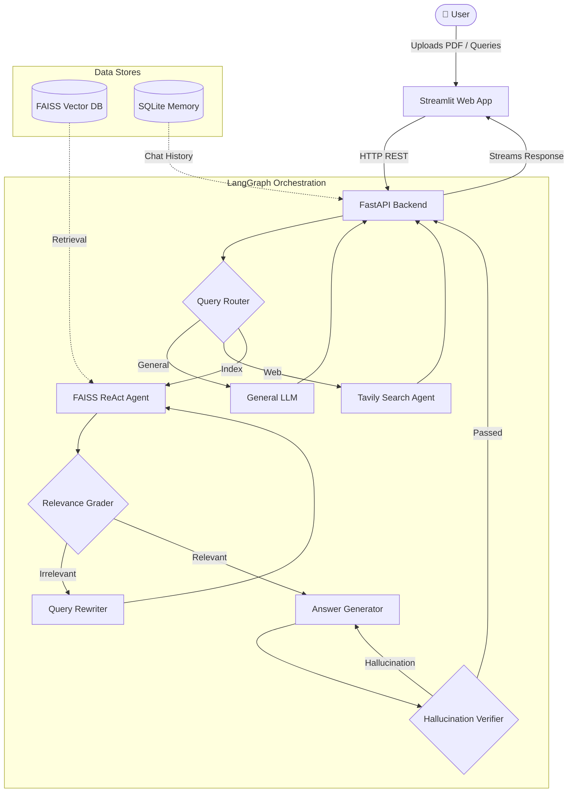

<div align="center">
  
  
  
  
  
</div>

<br>

<div align="center">
  <h1 align="center">🧠 Adaptive RAG: Agentic AI Chatbot</h1>
  <p align="center">
    <strong>A State-of-the-Art, Multi-Agent Retrieval-Augmented Generation Platform</strong>
  </p>
</div>

<br>

## 🌟 Overview

**Adaptive RAG** is an intelligent, end-to-end Retrieval-Augmented Generation (RAG) ecosystem powered by an **Agentic AI Architecture**. Moving beyond traditional naive RAG, this platform employs a dynamic query-routing mechanism, intelligent document retrieval, strict hallucination verification, and multi-agent coordination (via LangGraph) to provide hyper-accurate, context-aware answers.

Whether interrogating local PDFs or searching the live web for real-time data, Adaptive RAG thinks, reasons, and self-corrects before it ever speaks.

---

## 🔥 Enterprise-Grade Features

### 🧠 Intelligent Query Routing
- **Zero-Shot Classification**: Uses `Pydantic` strict outputs to dynamically route queries into three distinct pipelines:
  - **Index**: Direct answers derived exclusively from your uploaded documents.
  - **General**: Broad world-knowledge queries bypassing the vector-store.
  - **Search**: Automatic failover to real-time Web Search (Tavily) when knowledge is missing.

### 📚 Advanced RAG Mechanics
- **Persistent Vector Store**: High-performance CPU-bound similarity search using **FAISS**.
- **Dynamic Citations**: The AI explicitly cites its sources in the format `[Source: document.pdf, Page: 12]`, giving you complete cryptographic trust in its answers.
- **Strict Hallucination Verification**: A dedicated "Grader Agent" compares generated answers against retrieved context to prevent hallucination mathematically.
- **Automated Query Rewriting**: Poorly phrased user queries are optimized in the background before hitting the vector database.

### 🤖 Multi-Agent ReAct Architecture
- **LangGraph Orchestration**: Uses a directed acyclic graph (DAG) to manage workflow states.
- **ReAct Agents**: Combines reasoning and acting to allow the AI to loop through tools until it successfully finds the data it needs.

### ⚡ decoupled API Architecture
- **FastAPI Backend**: Fully asynchronous, high-throughput RESTful API decoupling the ML logic from the user interface.
- **Streamlit Frontend**: A gorgeous, reactive, and responsive chat interface.
- **Thread-Safe SQLite**: Persistent, concurrent memory management and session tracking across Uvicorn threads.

---

## 🏗️ System Architecture



---

## 🚀 Getting Started

### 1. Prerequisites
- Python 3.9+
- An OpenAI API Key
- A Tavily API Key (for Web Search functionality)

### 2. Installation

Clone the repository and install the dependencies:
```bash
git clone https://github.com/AyushGU12/AI_CHATBOT.git
cd AI_CHATBOT
python -m venv venv
source venv/bin/activate  # On Windows: .\venv\Scripts\activate
pip install -r requirements.txt
```

### 3. Environment Variables
Create a `.env` file in the root directory:
```env
OPENAI_API_KEY=your_openai_api_key_here
TAVILY_API_KEY=your_tavily_api_key_here
```

### 4. Run the Platform
Because this is a decoupled architecture, you must run the API and the Frontend on separate ports.

**Terminal 1 (Backend):**
```bash
python -m uvicorn src.main:app --host 0.0.0.0 --port 8000
```

**Terminal 2 (Frontend):**
```bash
python -m streamlit run streamlit_app/home.py
```

Navigate to `http://localhost:8501` in your browser.

---

## 📂 Project Structure

```text
📦 AI_CHATBOT
 ┣ 📂 src
 ┃ ┣ 📂 api         # FastAPI Routing & Endpoints
 ┃ ┣ 📂 config      # YAML Prompts & Environment Settings
 ┃ ┣ 📂 llms        # OpenAI Model Configurations
 ┃ ┣ 📂 memory      # SQLite Persistent Chat & Document Management
 ┃ ┣ 📂 models      # Pydantic Structured Data Models
 ┃ ┣ 📂 rag         # Core LangGraph, FAISS, and ReAct Pipelines
 ┃ ┗ 📂 tools       # LangChain Custom Tools (Grading, Verification)
 ┣ 📂 streamlit_app # React-style UI components & API Clients
 ┣ 📜 .env          # Secrets
 ┣ 📜 .gitignore    # Safe-guards
 ┣ 📜 requirements.txt
 ┗ 📜 README.md     # You are here
```

---

<div align="center">
  <i>Built with absolute precision for robust, intelligent information retrieval.</i>
</div>


## Deployment
- Cloud Run CI/CD configured in `.github/workflows/deploy-cloudrun.yml`.
- Run `gcloud run deploy` to deploy the backend.

## 🚀 Cloud Deployment Architecture

This project is fully optimized for cloud deployment with 100% parity to the local development environment. It supports a dual-architecture deployment model:

### 1. Platform Native (PaaS)
Pre-configured for zero-downtime deployment on platforms like Render, Vercel, or Firebase.
- Native configuration files (e.g., 
ender.yaml) are included for one-click deployments.
- Environment variables prioritize cloud APIs (Groq, Gemini, OpenAI) to ensure compatibility with free-tier memory limits.

### 2. Dockerized Containers
For isolated, infrastructure-agnostic deployment on VPS or Cloud Run.
- **Multi-stage Dockerfile**: Optimized for lightweight, fast builds.
- **docker-compose.yml**: Configured with strict health checks, network isolation, and unless-stopped restart policies.
- Automatically handles local dependencies and avoids local OOM crashes by prioritizing cloud inference APIs.

### 🔄 CI/CD Pipeline
Continuous Integration and Deployment is handled via GitHub Actions.
- Workflows are configured in .github/workflows/ to automatically test and deploy changes pushed to the main branch.
