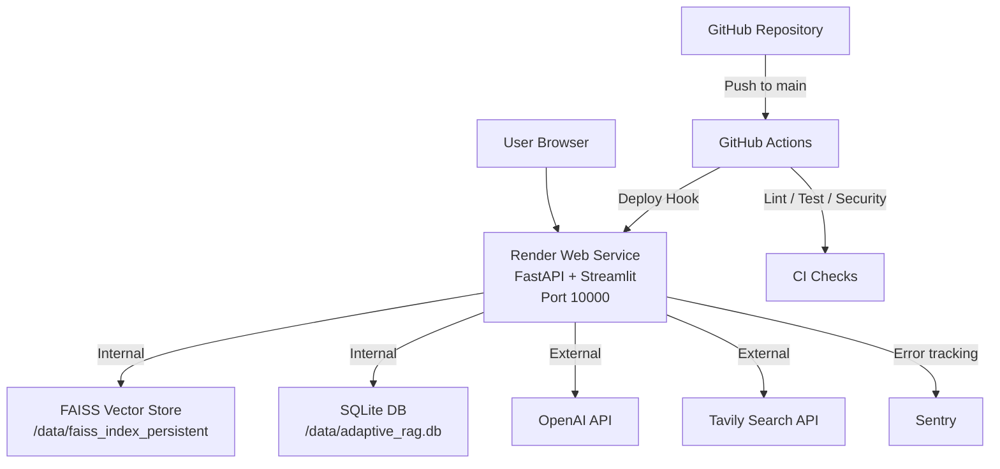
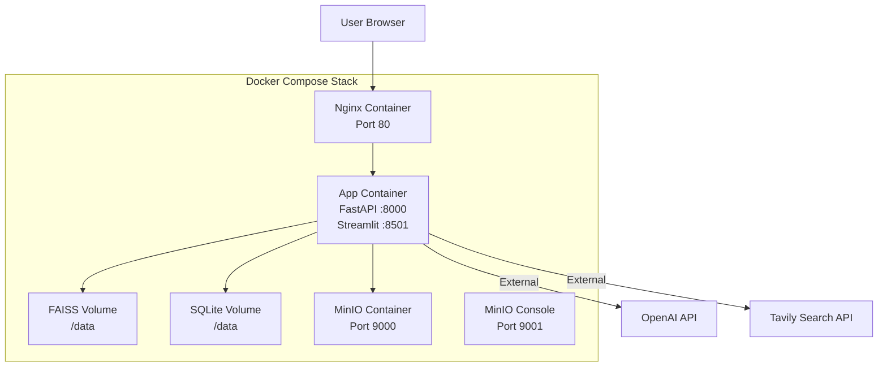

# Deployment Architecture

Both models are **independent** — they share the same codebase but use completely separate infrastructure. Switch between them without touching application code.

---

## Model 1 — Cloud Native (Managed, Free Tier)

Deploy in minutes. No server management. No credit card.



**Providers (all free, no credit card):**

| Layer | Service | Free Tier |
|---|---|---|
| Compute | Render Web Service | 750 hrs/month |
| Frontend Alt | Streamlit Community Cloud | Unlimited |
| AI Backend | Hugging Face Spaces | 16GB RAM free |
| CI/CD | GitHub Actions | 2000 min/month |
| Monitoring | Sentry | 5K errors/month |

---

## Model 2 — Self-Hosted Docker Compose

Run identically on any machine: Windows, Mac, Linux, VPS, EC2.



**Single command to launch:**
```bash
# 1. Copy and fill in your secrets
cp infra/docker/.env.example infra/docker/.env

# 2. Launch the full stack
docker-compose -f infra/docker/docker-compose.yml up -d

# 3. Open your browser
# Streamlit UI  → http://localhost
# MinIO Console → http://localhost:9001
```

---

## Architecture Comparison

| Aspect | Model 1 (Cloud Native) | Model 2 (Self-Hosted) |
|---|---|---|
| **Setup time** | 10 minutes | 5 minutes (with Docker) |
| **Cost** | Free forever | Free (runs locally) |
| **URL** | Public HTTPS link | `localhost` |
| **Scales** | Automatically | Manual |
| **Persistence** | Render Persistent Disk | Docker Named Volumes |
| **Best for** | Portfolio, demos, interviews | Local dev, VPS, teams |
